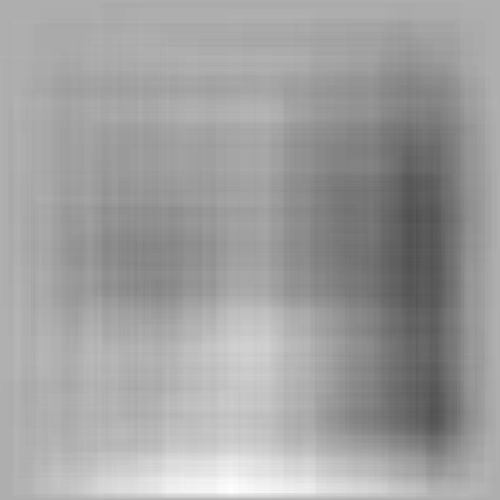

## ファイル構成

- app.py streamlit でのアプリ実装部分
- bul_image_maker.py ぼかし画像を作成

## アプリで作成される画像のサンプル

  

```sh:mac仮想環境作成
# 仮想環境の作成
python -m venv .venv

# 仮想環境のアクティベート
source .venv/bin/activate

# pip のアップグレード
python -m pip install --upgrade pip

# ライブラリのインストール
pip install -r requirements.txt

# streamlit アプリをローカルで起動
streamlit run app.py
```

Check out the configuration reference at https://huggingface.co/docs/hub/spaces-config-reference
